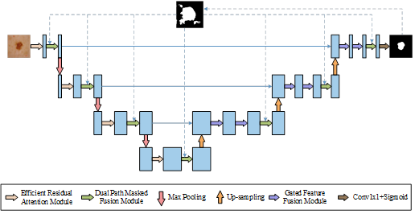

# IMANet: An Iterative Multi-scale Attention Network for Skin Lesion Segmentation
Authors: Dangguo Shao, Mengying Yang, Lei Ma, Sanli Yi
 

## Abstract

Accurate segmentation of skin lesions is crucial for early melanoma detection and improved prognosis. However, this task remains challenging due to issues such as hair interference, low contrast and blurred boundaries in dermoscopic images.In this study, we propose IMANet, an Iterative Multi-scale Attention Network, which incorporates three key modules: the Efficient Residual Attention module (ERA), the Dual Path Masked Fusion module (DPMF), and the Gated Feature Fusion module (GFF). The ERA module enhances features representation by adjusting channel weights through the Efficient Channel Attention (ECA) mechanism and combining efficient convolution with residual connections. The DPMF module extracts multi-scale features using convolutional kernels of different sizes and adjusts feature importance via a dynamic masking mechanism. The GFF module dynamically fuses multi-scale features through a gating mechanism, addressing the issue of insufficient contextual information. Experiments conducted on the public ISIC2018 dataset demonstrate the effectiveness of IMANet, achieving superior performance compared to state-of-the-art methods. Our approach not only improves segmentation accuracy but also enhances the visualization of lesion boundaries, which is crucial for clinical applications. 

## Architecture

## Dataset:

- [ISIC 2018](https://challenge2018.isic-archive.com/task1/)

## Contact
Please contact myyang@gmail.com for any further questions. 
